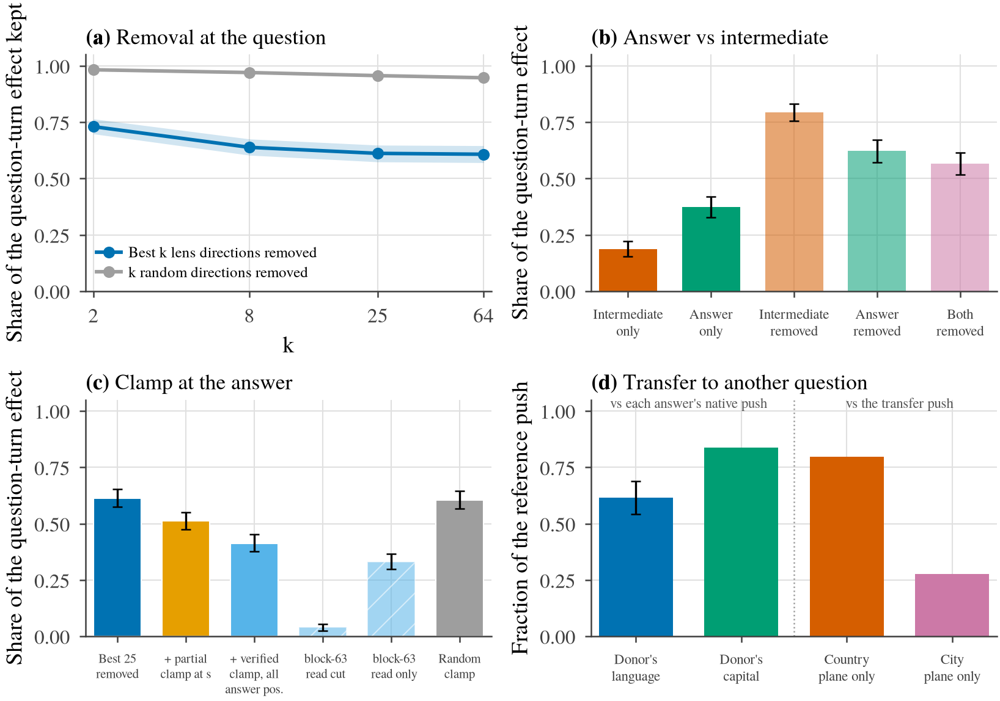

# What the answer depends on at the question: the question-turn ladder (H3, Amendments 5–9)

_Consolidated write-up, drafted 2026-09-24 on branch `extension` for the researcher's review. Every number is copied from a committed report or table; the per-stage reports are the evidence of record and are listed in §8. Registered predictions and post-hoc analyses are kept apart in §7._

## 0. Claims and red-team

**Claims** (the write-up argues for these three and nothing broader):

1. **Most of the question-turn state's effect on the answer lies outside the directions a Jacobian-lens vocabulary names.** Removing the 25–64 lens directions that best fit the donor's change on the question tokens keeps about 0.61 of the effect; removing as many random directions of the same size keeps 0.95–0.96. This holds on 35 items across six kinds of two-hop fact.
2. **At the question turn, the readable leverage belongs more to the answer than to the intermediate, and the state already carries the answer.** The answer's two readable directions carry twice what the intermediate's do, in every item. A capital question's state, pasted into a language question about the same city, reverses the capital ordering there in 26 of 28 cells. The same state also moves the other question's answer at about half strength, so content upstream of the answer rides along.
3. **About two fifths of the effect reaches the answer without passing through readable content at the answer position, through the last layer's direct read of the question tokens.** With the intermediate's and the answer's readable content held at clean at every scored answer position (verified: readouts there at about zero), 0.41 [0.38, 0.45] of the effect still arrives. Cutting the last layer's attention from the answer positions to the question tokens leaves 0.04 of it; opening only that read, with the answer positions entirely clean until then, delivers 0.33.

**Red-team** (what a skeptical reader should ask, and where the answer is):

- *Could "not lens-readable" just mean "the dictionary is bad"?* Partly. The pursuit selects junk tokens alongside real content, and at 64 directions it captures no more of the state's energy than random directions drawn from the model's own covariance. Claim 1 is scoped to "the span of the directions this dictionary selects"; the random-direction control shows that span is still strongly privileged (§4.1).
- *Are the rows the model's natural computation?* No. Every row is a fixed state trajectory: the written component is held at a set value through blocks 36–62. Shares compare trajectories; they are not a partition of one computation (§5).
- *Was the clamp at the answer position complete?* Not until Amendment 9. The Stage 2 clamp was partial (readouts at the answer position stayed at about +1.5). Amendment 8 verified the readouts at about zero but clamped only the first answer token, while the endpoint also scores continuation tokens (silly mistake 5). Amendment 9 closes both (§4.4).
- *Is the answer-plane advantage an artefact of the output vocabulary's geometry?* The answer-smuggling screen found no relation in which the answer's unembedding row is an affine image of the intermediate's (low power; §4.2).
- *One model?* Yes: Qwen3.6-27B (hybrid attention), thinking off, one question wording, same-template minimal-pair donors. No claim here extends past that (§5).

## 1. Abstract

The workspace paper argues that representations a Jacobian lens can verbalize form a global workspace that downstream computation draws on. This project asks whether what the lens reads is what the model's answer depends on. In a copy-then-answer organism built on the paper's own two-hop items, earlier stages found that a readable copy of the answer in the copied text moves the answer far less than the source does while the source is visible. This write-up asks the same question at the one place that clearly matters, the question the model answers: which part of the question-turn state carries the answer, and how much of it the lens can read. Across 35 items and six relation types, the part named by the best lens directions carries about two fifths of the question-turn effect, far more than random directions of the same size, but not most of it. Of the readable part, the answer's directions carry twice what the intermediate's do, and a transplant between two questions shows the answer is already present at the question turn, together with content upstream of it. Holding the readable content at the answer position fixed still lets about two fifths of the effect through, and nearly all of that arrives through the final layer's direct attention to the question tokens. What carries over to a different question about the same city is the country's readable plane. Readability of the intermediate is a poor proxy for how the answer to the asked question is produced, as it was across positions, and a good proxy for what carries over to a neighbouring question.

## 2. What was known, and what this adds

The workspace paper's causal case studies swap the lens coordinates of an intermediate (for example Spain ↔ Canada) and show the answer moves. On this model and organism, the same swap moves the answer at 0.41 of the full-residual ceiling, half of it from the question turn, and swapping the answer word moves it more (0.63), as Nanda observed (Amendment 4). Earlier H3 stages established a position asymmetry: donor content installed in the copied text shifts the answer 0.02–0.27 of what the same content does at the source, while the source is visible (`STATUS.md`). This write-up moves from *where* the readable content sits to *what* carries the answer at a position that matters, the question turn, and asks how much of that is lens-readable.

## 3. Setup

- **Organism.** A user turn gives a clue ("the capital of the country where Barcelona is located"), asks the model to copy a sentence, and a final question turn asks for the one-word answer. The question turn's token ids are identical across all prompts. The *donor* prompt differs only in the clue's cue, for most items one city name (Toronto), so its answer differs (Ottawa, not Madrid).
- **Intervention.** At every block 36–62, the question-turn positions except the last (`q_pre`) are overwritten with a fixed target built from the donor's state; the final position s, where the answer is produced, is never written except by the clamps of §4.4. The residual is carried in float32 from block 35 so writes are exact (ρ = κ = 1.000 throughout).
- **Endpoint.** The sequence log-prob margin log P(donor's answer) − log P(own answer), summed over tokens and log-sum-exp'd over spellings, minus the clean run's margin. A row's **share** is its item-mean margin over the full question-turn donor's (`q_full_pre`, +11.16 nats on the admitted items, 35/35 positive). Intervals are item-clustered; share intervals are cluster bootstraps over items.
- **Lens directions.** For a vocabulary word v at block l, the folded direction J_lᵀ(γ ⊙ w_v) is the direction whose coordinate the Jacobian lens (J_NP) reads as v. A *plane* is the span of two such directions (for example Spain and Canada). The *J_k part* of the donor's change is its least-squares fit on the k directions chosen greedily from all 248 320 vocabulary words; the *complement* is what is left.
- **Items.** Twelve released two-hop items (Stage 1) and 30 constructed ones over five templates; 35 of 42 pass admission (competent in all four copy sentences, and swapping the intermediate at mid depth moves the answer more than swapping the answer). Every stage was registered before its forwards (Amendments 5–9 of `H3/design_specs/two_hop_organism.md`).

## 4. Results

_Figure 1. The question-turn ladder on the 35 admitted items (panels a–c) and seven city pairs (panel d). (a) Share of the question-turn effect kept after removing, on the question tokens, the k lens directions that best fit the donor's change (blue) or k random directions of the same size (grey); bands are 95 % cluster-bootstrap intervals over items. (b) Share installed by the intermediate's or the answer's two-direction plane alone (solid), and kept after removing one or both (pale). (c) Holding readable content at the answer position fixed: the best-25 complement alone, with the Stage 2 partial clamp at the first answer position, with the verified clamp at every scored answer position, then split by whether the last layer's read of the question tokens is cut or is the only route (hatched), and a random clamp of the same rank. (d) A capital question's state pasted into a language question about the same city: push toward the donor's language and toward the donor's capital, each as a fraction of that answer's native push; then the country's and the city's readable planes alone as fractions of the transfer push._

### 4.1 Most of the question-turn effect lies outside the best lens directions

Writing the donor's question-turn state into the clean run moves the answer by +11.16 nats (35/35 items; 50 of 140 cells cross). Removing the donor change's component on the best k lens directions keeps 0.73, 0.64, 0.61 and 0.61 of that at k = 2, 8, 25 and 64; removing k random directions of the same size keeps 0.98, 0.97, 0.96 and 0.95 (Figure 1a; Stage 2, every row positive in 35/35 items). The lens directions are therefore strongly privileged: 25 of them carry 0.39 of the effect where 25 random directions carry 0.04. They are not most of it, and the curve flattens after k = 25 while the fitted part saturates at 0.27–0.29 of the change's norm.

The dictionary itself limits how far "not lens-readable" can be pushed. The two-direction pursuit contains the exact intermediate or swap-to word in only 4 % of question-token fits at layers 51–59, junk tokens (`\n\n`, end-of-text, digits) dominate the pooled selection, and at k = 64 the fitted part captures no more of the change's energy than 64 random directions drawn from the model's own covariance (0.066 vs 0.069). At the two informative positions (the last question token and the answer position), 7.5–14 % of the chosen directions are the item's words, their translations or their close associates (up to 22 % by weight), against 1 % pooled over all question tokens. The chosen directions carry the entity at their head and pad the fit with noise in their tail. Claim 1 is therefore about the span this dictionary selects; a better basis could name more.

Stage 2 reproduces the twelve released items of Stage 1 to the second decimal, and its shares on all 42 items differ from those on the 35 admitted items by at most 0.028; constructed and released donors behave alike.

### 4.2 The readable leverage belongs more to the answer than to the intermediate

Installing only the intermediate's plane (for Barcelona–Toronto, the Spain and Canada directions) moves the answer 0.19 of the way; installing only the answer's plane (Madrid and Ottawa) moves it 0.37, more in all 35 items (+2.08 nats [+1.63, +2.54]) and in every relation type, at slightly smaller norm (Figure 1b). Removing the intermediate plane costs 0.21 of the effect, the answer plane 0.38, and both together 0.43: about three quarters of the intermediate plane's effect (overlap 0.72 [0.64, 0.79]) is already carried by the answer plane, and the intermediate plane adds 0.057 on its own (Amendment 8 (a)). The two planes' directions have a mean cosine of 0.44, so part of the overlap is geometric.

A skeptic might suspect the vocabulary geometry: if the answer's output direction were a fixed linear image of the intermediate's, the two planes would be the same handle in different coordinates. The answer-smuggling screen fitted that map per relation and found no relation where it predicts held-out pairs better than chance (residual fractions 0.94–1.00 against mismatched-pair nulls of 1.00–1.04); the test has little power at 10–22 pairs per relation.

### 4.3 The question-turn state already carries the answer, and something upstream of it

The strongest test of "the answer is already computed at the question turn" moves the state to a question that asks for something else (Amendment 8 (c), seven city pairs). The change in the question-turn state between "the capital of the country where Lyon is" and "…where Naples is" is written into "the language spoken in the country where Lyon is". Across the seven pairs, the pasted state pushes the language question toward the donor's capital (Rome over Paris in the example) by 0.84 of the capital question's own push, and reverses the capital ordering in 26 of 28 cells although the question asks for a language. The mirror (the language question's change pasted into the capital question) pushes toward the donor's language by 0.96 of the language question's own push. Each question's state carries its own answer, strongly enough that a different question's output registers it.

It is not the only thing carried. The same capital state moves the language question toward the donor's language (Italian in the example) by 0.61 [0.54, 0.69] of that question's own change, in 7 of 7 pairs, and the mirror moves the capital question toward the donor's capital by 0.45 [0.38, 0.50]; random vectors of the same size move either by less than 0.02. Something upstream of the answer is present and moves the other question's answer at about half strength.

**It is the country, at the level of readable planes** (Amendment 9, part 2). Writing only the country-plane component of the capital question's change (the France and Italy directions) into the language question gives 0.80 of the full transfer push toward the donor's language; the city plane alone (Lyon and Naples) gives 0.28, and a random plane of the same size 0.005. Removing the country plane from the transferred change leaves 0.27; removing the city plane leaves 0.73. All seven pairs agree (country plane alone 0.74–0.83), and the mirror direction does too (0.63 against 0.18). Inside the capital question, the intermediate's plane carries only 0.19 of the capital effect; carried into a neighbouring question, the same kind of plane delivers four fifths of what the whole change delivers there. One caveat stays attached: the country's directions are not orthogonal to the other question's answer words (the ladder items' intermediate and answer directions have a mean cosine of 0.44), so part of the country plane's push may be geometric overlap rather than the model deriving the language from the country.

### 4.4 A bypass around the readable content at the answer position, through the last layer

The consumer clamps hold, at the answer position, the coordinates that the lens reads as the intermediate or the answer at their clean values through blocks 36–62, while the question tokens carry the donor's change with its best 25 lens directions removed (0.61 of the effect, Figure 1c). The ladder of clamps tightened over three amendments:

| clamp at the answer position | readouts there (intermediate / answer) | share of the effect kept | source |
|---|---|---|---|
| none (best 25 removed on the question tokens) | +2.67 / +2.45 | 0.61 [0.57, 0.65] | Stage 2 |
| the 25 atoms that best fit the donor's change there, first answer token only | +1.49 / +1.32 | 0.51 [0.47, 0.55] | Stage 2 |
| verified: every form of the four words, their translations and those 25 atoms, first answer token only | −0.04 / −0.03 | 0.43 [0.40, 0.48] | Amendment 8 |
| verified, at every scored answer position | −0.04 / −0.03 | **0.41 [0.38, 0.45]** | Amendment 9 |
| random frame of the same rank and norm | +2.65 / +2.43 | 0.61 [0.57, 0.64] | Amendment 9 |

The Stage 2 clamp was partial, and Amendment 8's was complete at the first answer token but not at the continuation tokens of multi-token spellings, which the endpoint also scores (silly mistake 5). Clamping every scored position removed 0.02 more, all of it from continuation tokens. At least 0.41 of the effect therefore reaches the answer without passing through the intermediate's or the answer's readable content at any answer position before the last layer.

Amendment 9 then cut routes at the final block, which is a full-attention layer:

- With the last layer's attention from the answer positions to the question tokens cut (post-softmax weight exactly 0), the clamped complement keeps **0.04** [0.03, 0.05].
- With every answer position held entirely at its clean state through block 62, so that only the last layer's read can carry anything, it keeps **0.33** [0.30, 0.37].
- With both cuts it keeps exactly 0 in every item.

Cutting that one read removes about nine tenths of the surviving effect overall, and at least three quarters in every relation type. For the whole question-turn change, the last layer's read alone delivers 0.41 of the effect, and cutting it leaves 0.69. The two routes are partly redundant.

What travels this route lies outside the 25 best-fitting lens directions on the question tokens and is not readable at the answer position before the last layer. It becomes readable only at the output, where the last layer writes the answer.

## 5. Limitations and threats to validity

- **Fixed trajectories, not natural computation.** Every row holds its written component at a set value through blocks 36–62, so rows are trajectories to compare, not parts of one computation. The additivity residuals of the plane and J_25 splits average under 0.25 nats (intervals within ±0.55), so the shares read as rough components, but they remain components of interventions.
- **"Lens-readable" means one dictionary.** The J_NP folded directions of single vocabulary tokens, selected greedily with least-squares refits. The dictionary is noisy (junk atoms, other-script forms counted by a mechanical rule), and a basis fitted differently could name more of the change. The random-direction and covariance-matched controls bound how much of the effect is special to lens directions; they do not bound how much a better basis would find.
- **One model, one setting.** Qwen3.6-27B (hybrid linear and full attention), thinking off, one question wording, four copy sentences, same-template minimal-pair donors. The dense-model replication used elsewhere in the project was not run for this ladder.
- **The hybrid architecture limits cuts.** The last layer is full attention, so its read of the question tokens is cut exactly. Earlier layers include linear-attention (recurrent) channels, so no route through the middle of the network is cut completely; the full-state clamp of the answer positions is the construction that avoids needing one.
- **Scale of inference.** 35 items (140 cells) for the ladder, seven pairs (28 cells) for the transfer rows; shares are ratios of item means with cluster-bootstrap intervals; per-relation numbers rest on 1–11 items and are descriptive.
- **Two silly mistakes, both caught by construction checks and recorded.** Silly mistake 4: the registered current-base row of Amendment 6 added the accumulated block change at every block (6.5–9× overshoot); its numbers were never read, and the repaired form ran in Stage 2. Silly mistake 5: the consumer clamps of Amendments 6–8 covered only the first answer token while the endpoint also scores continuation tokens; Amendment 9 measured its size (§4.4).
- **Scope of the transfer test.** It separates answer content from upstream content. Separating the country from the cue city relies on their readable planes only (§4.3).

## 6. What this does and does not say about the workspace claim

The paper's causal evidence is that swapping an intermediate's lens coordinates moves the answer. That holds here, and the readable directions are privileged well beyond their size. What does not hold, in this organism, is the stronger reading that the answer is computed *through* the readable intermediate at the question turn. The readable part is a minority of the whole effect, is dominated by the answer's own directions, and, once readable content at the answer position is held fixed, a large share still arrives by the last layer's direct read of the question tokens. A workspace in the paper's sense is present and causally connected; it is not the main channel by which the answer depends on the question-turn state here. This mirrors the project's position result: the readable copy in the copied sentence is consulted only weakly while the source is visible.

**Not licensed by this ladder:** "the answer bypasses the workspace" or "a route no lens can read" (the route's content is outside one dictionary's best directions and becomes readable at the output); "the model ignores the intermediate" (it carries 0.19 within a question and most of what transfers across questions); "the model derives the language from the country" (the geometric-overlap caveat of §4.3); anything beyond one hybrid model, thinking off and one question wording.

## 7. Registered predictions and post-hoc analyses

| analysis | status |
|---|---|
| k-sweep, planes, answer plane, consumer clamps, current base, random controls (Amendments 6, 7) | registered; predictions scored in the per-stage reports. Amendment 6's P2 ("k = 2 picks the intermediate"), P3 ("B_ans ≤ 0.5") and P7 at k = 64 failed, its current-base row was not read (construction failure), and Amendment 7's predictions held |
| admission gates, answer-smuggling screen, 42-item bank (Amendment 7) | registered before any forward |
| joint-plane removal, verified clamp at s, relation transfer (Amendment 8) | registered before any forward, run registration added before the run |
| clamp over every scored position, block-63 route split, country/city planes (Amendment 9) | registered before any forward |
| content check at the informative positions; per-item J_25 split; readouts at s under the clamps | post hoc, defined after reading six seeded cells (researcher's note of 2026-09-24) |
| cluster-bootstrap intervals on shares; flip counts in the transfer rows | added at analysis time on the same raw arrays |

## 8. Where the evidence lives

| stage | report | design | raw arrays |
|---|---|---|---|
| Amendment 5 (`qsplit`) | `H3/results/reports/two_hop_qsplit.md` | `two_hop_organism.md` Amendment 5 | `raw_qsplit.npz` |
| Amendment 6 (`qsplit6`, Stage 1) | `two_hop_qsplit6.md` | Amendment 6 | `raw_qsplit6*.npz`, `raw_pursuit_qsplit6.npz` |
| Amendment 7 (`admit`, `stage2`) | `two_hop_stage2.md` | Amendment 7 | `raw_admit*.npz`, `raw_stage2*.npz`, `raw_pursuit_stage2.npz`, `screen_stage2.json` |
| Amendment 8 (`probe3`) | `two_hop_probe3.md` | Amendment 8 + run registration | `raw_probe3*.npz`, `raw_pursuit_probe3.npz` |
| Amendment 9 (`probe4`) | `two_hop_probe4.md` | Amendment 9 | `raw_probe4*.npz` |

All under `H3/outputs/two_hop_organism/` (raw) and `H3/results/` (reports, tables, figures); scripts in `H3/scripts/` (`two_hop_qsplit6.py`, `two_hop_probe3.py`, `two_hop_probe4.py` and their `_analysis.py` companions; this figure by `make_question_turn_ladder_figure.py`). Every raw file is under 100 MB and committed; manifests carry SHA-256 hashes.
